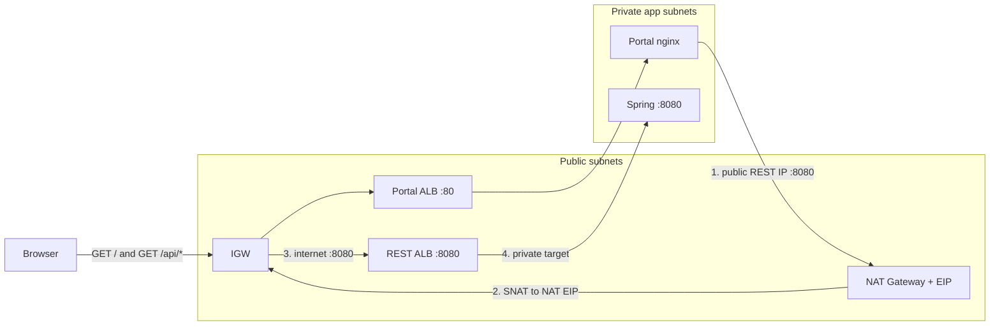
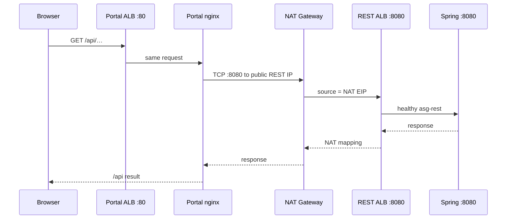

# Operator guide — set up AWS and deploy the projects

This is a beginner walkthrough for the GitHub Actions in this repo.

You will:

1. Create the AWS estate (`apply`)
2. Deploy the portal, REST API, and Haystack onto that estate (`deploy-projects`)
3. Pause or wipe when you are done (`stop` / `destroy`)

There are **two Actions**. Do not put Vocareum keys on the paid Action.

| Action | When | How you authenticate |
| --- | --- | --- |
| **AWS infrastructure (Academy)** | AWS Academy Learner Lab (Vocareum) | Start Lab keys on the form, or Environment `academy` `AWS_*`. `aws_environment` **must** be `academy`. |
| **AWS infrastructure (paid)** | Billed public AWS account | Environment `AWS_ACTUAL` variable **or** secret `AWS_ROLE_TO_ASSUME` (GitHub OIDC). **No** Vocareum form fields. Guide: [`docs/OIDC-PAID.md`](docs/OIDC-PAID.md). |

Do **not** put `AWS_ACCESS_KEY_ID` on Environment `AWS_ACTUAL`. OIDC sample: [`docs/samples/github-oidc-paid.json`](docs/samples/github-oidc-paid.json).

Related reference (more compact): [`docs/BOOTSTRAP.md`](docs/BOOTSTRAP.md). Specs: [`specification/pipelines/infra-academy.md`](specification/pipelines/infra-academy.md).

---

## How the pieces fit

| Tool | What it does | What it does not do |
| --- | --- | --- |
| **Terraform** | Creates AWS *architecture*: VPC, NAT Gateways, 8 app EC2 + 1 maintenance bastion, load balancers, two RDS databases, empty Secrets Manager shells | Does not install Docker or start your apps |
| **Ansible** | Configures *existing* EC2: Docker, `.env` from Secrets Manager, compose | Does not create VPCs, ASGs, or RDS |
| **This GitHub Action** | Runs Terraform and/or Ansible for you over SSM | Does not rebuild portal / REST / Haystack from source |

**Important:** `apply` does **not** start the three apps. After apply, the public portal URL returns **502** until you run **`deploy-projects`** in a **new** workflow run.

How `/api` reaches Spring (NAT hairpin, 504 vs 502): [Portal `/api` through NAT](#portal-api-through-nat). Full diagrams: [`docs/ARCHITECTURE.md`](docs/ARCHITECTURE.md#portal-api-hairpin-through-nat).

```
First lab day
  bootstrap   (once — state bucket)
       │
       ▼
     plan     (optional — preview only)
       │
       ▼
     apply    (create estate + Docker + Neo4j)
       │
       ▼
  Set image variables on Environment academy
       │
       ▼
 deploy-projects   ← new Run workflow, not the same run as apply
       │
       ▼
    Apps up (or 502 is gone on the portal ALB)
```

Later the same day, after you **Start Lab** again: `configure-only` (refresh guests), then `deploy-projects` only if you need to compose the apps again.

---

## One-time GitHub setup

Do this once on **this** repository (the infra repo), not on the portal / REST / Haystack app repos.

### 1. Create Environment `academy`

1. GitHub → this repo → **Settings** → **Environments** → **New environment**
2. Name it exactly `academy`
3. GitHub cannot create this from git. Vocareum uses Environment `academy`. Public AWS uses Environment `AWS_ACTUAL`.

### 2. Add secrets (Settings → Environments → academy → Environment secrets)

These are **not** typed on the Run form.

| Secret | Required for | Notes |
| --- | --- | --- |
| `SPRING_DATASOURCE_PASSWORD` | `apply`, `configure-only`, `deploy-projects` | At least 8 characters. RDS master password |
| `NEO4J_PASSWORD` | same | Neo4j admin password |
| `STRIPE_PUBLISHABLE_KEY` | same | `pk_…` |
| `STRIPE_API_KEY` | same | `sk_…` — never put this on the portal |
| `STRIPE_WEBHOOK_SECRET` | same | Webhook signing secret |
| `AWS_ACCESS_KEY_ID` | optional fallback | Only if you do not paste Vocareum keys on the form |
| `AWS_SECRET_ACCESS_KEY` | optional fallback | Same |
| `AWS_SESSION_TOKEN` | optional fallback | Same |

Do **not** add `VITE_STRIPE_PUBLISHABLE_KEY` (the pipeline copies it from the publishable key).

### 3. Add variables (Environment **variables**, not secrets)

| Variable | Value | When you need it |
| --- | --- | --- |
| `AWS_REGION` | `us-east-1` | Always |
| `ALARM_EMAIL` | Your email | Optional. SNS confirms before alarm mail. Apply works if empty |
| `BASTION_SSH_CIDRS` | Your public IPv4 `/32`, comma-separated | Optional. Empty = SSM onto `hr-bastion`, then SSH to guests. **Not** `0.0.0.0/0` |
| `PORTAL_IMAGE` | Public GHCR or ECR tag | **Required** before `deploy-projects` |
| `REST_IMAGE` | Public GHCR or ECR tag | **Required** before `deploy-projects` |
| `HAYSTACK_IMAGE` | Public GHCR or ECR tag | **Required** before `deploy-projects` |

You can add the three image variables after `apply` succeeds. `apply` does not read them for compose.

**Images must be publicly pullable** (or already in this lab’s ECR). Private GitHub packages fail on purpose — the EC2 guests have no GitHub token.

Leave `IMAGE_HTTP_URL` unset for `deploy-projects`. One image tar cannot satisfy three apps.

These names on the **infra** Environment `academy` are separate from the same names on the three application repos.

### 4. Paid Environment `AWS_ACTUAL` (billed account)

Do this once if you will run **AWS infrastructure (paid)**. Do **not** paste Vocareum keys into this Environment.

**Full walkthrough (AWS Console + CLI + GitHub):** [`docs/OIDC-PAID.md`](docs/OIDC-PAID.md).

1. In AWS, create the GitHub OIDC provider and role `github-actions-infra` (script: `GITHUB_ORG=YOUR_ORG ./scripts/bootstrap-github-oidc-paid.sh`). Copy the **role ARN**.
2. **Settings → Environments → New environment** named exactly `AWS_ACTUAL`.
3. Store the ARN as Environment **variable** `AWS_ROLE_TO_ASSUME` **or** Environment **secret** `AWS_ROLE_TO_ASSUME` (same name; either works). This is not an AWS access key.
4. **Variable** `AWS_REGION` = `us-east-1`. Same optional image variables, `ALARM_EMAIL`, and `BASTION_SSH_CIDRS` as academy (this Environment’s copies, not academy’s).
5. **Secrets:** same app set as academy (`SPRING_DATASOURCE_PASSWORD`, `NEO4J_PASSWORD`, Stripe trio, optional JWT / OneMap / `LLM_API_KEY`). **No** `AWS_ACCESS_KEY_ID` / `AWS_SECRET_ACCESS_KEY` / `AWS_SESSION_TOKEN`.

Then: **Actions → AWS infrastructure (paid)** → `aws_environment` = `AWS_ACTUAL` → `plan`, then `apply`, then a **later** `deploy-projects`. Same action meanings as academy. Paid first-compose is this Action’s `deploy-projects`. Day-to-day portal / REST / Haystack rolls are app CD in `heavy-rental-project-pipeline-development` (academy **and** paid callers).

REST is reachable at `http://<rest_alb_dns>:8080` after compose (public ALB). Portal remains `http://<portal_alb_dns>/`. Haystack stays internal.

---

## Every lab session

Vocareum AWS keys **expire when the lab session ends**. Start Lab again before you run the Action.

1. In Instructure / Vocareum, click **Start Lab**.
2. Open **AWS Details**.
3. Copy the three values: Access Key, Secret Key, Session Token.
4. In this GitHub repo: **Actions** → workflow **AWS infrastructure (Academy)** → **Run workflow**.
5. Fill the form (next section) and run.

Expect **20–40 minutes** for `apply` (two Multi-AZ RDS plus NAT and ALBs). That spends lab credits. Start the run at the **beginning** of a lab session — if Vocareum cancels the session mid-apply, state may not save.

**Ending the Vocareum session does not stop AWS billing.** NAT Gateways and ALBs keep billing until you run `destroy`.

---

## How to fill the Run workflow form

Every run uses the same form. Only some fields matter for each action.

| Field | What to choose | Notes |
| --- | --- | --- |
| **Use workflow from** | The branch that has this pipeline (usually your infra branch) | |
| **action** | See [each action](#each-action) below | Required |
| **aws_environment** | `academy` | Always. Any other name is refused |
| **confirm_destroy** | `no` unless you mean to wipe the estate | For `destroy` you must also pick `destroy` here |
| **aws_access_key_id** | Vocareum Access Key | Or leave empty if Environment secrets are set |
| **aws_secret_access_key** | Vocareum Secret Key | Same |
| **aws_session_token** | Vocareum Session Token | Same |
| **image_ref** | Usually empty | Optional fallback tag for REST and Haystack only. Does **not** set the portal |
| **image_http_url** | Leave empty | `deploy-projects` **fails** if this is set |

Job logs mask the three keys. The run **Inputs** page may still show them. Treat that page as sensitive.

On **AWS infrastructure (paid)** the form has **no** Vocareum key fields. Use `aws_environment` = `AWS_ACTUAL` and the same `action` / `confirm_destroy` / image fields.

---

## Recommended first-time path

Run these as **separate** workflow runs, in order.

| Step | `action` | Why |
| --- | --- | --- |
| 1 (once) | `bootstrap` | Creates the S3 bucket that stores Terraform state |
| 2 (optional) | `plan` | Shows what `apply` would create. Safe. No guests, no apps |
| 3 | `apply` | Creates the estate and installs Docker + Neo4j. Portal URL is **502** |
| 4 | *(no run)* | Set `PORTAL_IMAGE`, `REST_IMAGE`, `HAYSTACK_IMAGE` on Environment `academy` |
| 5 | `deploy-projects` | **New run.** Pulls the three images and starts the apps |

Do not try to do step 3 and step 5 in one click. `deploy-projects` is not chained onto `apply`.

---

## Each action

### `bootstrap` — create the state bucket (once)

**When:** The first time this lab account needs remote Terraform state. Skip it if a previous `bootstrap` or `apply` already created the bucket.

**What it does:** Creates an S3 bucket (with a lockfile) **outside** the estate. Does not create VPC, EC2, or RDS.

**Form:**

- `action` = `bootstrap`
- `aws_environment` = `academy`
- `confirm_destroy` = `no`
- Paste the three Vocareum keys

**Success:** Job is green. Later `plan` / `apply` can `terraform init` against that bucket.

**Do not:** Run this expecting apps or EC2. Nothing is deployed.

---

### `plan` — preview the estate (safe)

**When:** You want to see what Terraform would create or change **without** spending the full apply.

**What it does:** Checks the Vocareum session, ensures the state bucket exists, runs `terraform plan`. No `terraform apply`. No Ansible. Works even if `SPRING_DATASOURCE_PASSWORD` is missing (uses a plan-only placeholder that is never applied).

**Form:**

- `action` = `plan`
- `aws_environment` = `academy`
- `confirm_destroy` = `no`
- Paste the three Vocareum keys

**Success:** Job summary shows the plan. No new EC2.

**Common problems:**

| Symptom | What to do |
| --- | --- |
| `voc-cancel-cred` / `s3:CreateBucket` AccessDenied on **Ensure S3 state backend** | The lab session is cancelled. See [Plan or apply fails: Vocareum cancelled credentials](#plan-or-apply-fails-vocareum-cancelled-credentials-voc-cancel-cred). |

**Do not:** Treat a green `plan` as “the lab is up.” You still need `apply`.

---

### `apply` — create the AWS estate

**When:** The lab has no estate yet, or you need Terraform to create/update resources.

**What it does:**

1. Confirms Environment `academy` and Vocareum keys
2. `terraform apply` — VPC, two NAT Gateways, four app ASGs + `hr-bastion` (**9 EC2**), ALBs, two RDS, secret *shells*
3. Writes app secrets into Secrets Manager (`sync-secrets`)
4. Writes break-glass SSH secrets after instances are healthy (`sync-ssh-keys`: `private_key_pem` is the **private** key; public line on guests; hop + role private keys on `hr-bastion`)
5. Ansible `configure.yml` — Docker + Compose on app guests (not `hr-bastion`), **Neo4j only**

It does **not** pull portal, REST, or Haystack images. That is why apply no longer fails on private GHCR.

**Form:**

- `action` = `apply`
- `aws_environment` = `academy`
- `confirm_destroy` = `no`
- Paste the three Vocareum keys
- Leave `image_ref` and `image_http_url` empty

**Success (about 20–40 minutes):**

- Four ASGs exist: `asg-portal`, `asg-rest`, `asg-haystack`, `asg-neo4j`. Jump host `hr-bastion` (single EC2) is running.
- Job summary shows the public portal ALB DNS
- That URL **502**s on port 80 until `deploy-projects` (or portal app CD)
- Secret `heavy-rental/portal` exists and has `REST_BASE_URL`
- CloudWatch dashboard `heavy-rental-academy` and CloudTrail `heavy-rental-academy` exist (S3 observe bucket). The apply job **verifies** trail, dashboard, and bucket before it succeeds. Guests still use **LabRole** / `LabInstanceProfile` — no new IAM

**Common problems:**

| Symptom | What to do |
| --- | --- |
| Missing `SPRING_DATASOURCE_PASSWORD` / Stripe / Neo4j password | Add them on Environment `academy`, re-run |
| `device index 0 … cannot be detached` | See [Apply fails: primary ENI](#apply-fails-device-index-0--cannot-be-detached) |
| `voc-cancel-cred` / `s3:CreateBucket` / `Failed to persist state to backend` | See [Plan or apply fails: Vocareum cancelled credentials](#plan-or-apply-fails-vocareum-cancelled-credentials-voc-cancel-cred) |
| `AlreadyExists` / `RepositoryAlreadyExists` / secret already exists | See [Apply fails: named object already exists](#apply-fails-named-object-already-exists) |
| Two VPCs named `heavy-rental-academy` | `destroy` (sweeps extras), then `apply`. Do not apply again until destroy finishes |
| `InstanceLimitExceeded` / Vocareum 9-EC2 cap while replacing the old `asg-bastion` | Scale `asg-bastion` to desired=0 first, then re-run `apply`. The jump host is now a single `hr-bastion` instance |
| You expected the React portal to load | Run `deploy-projects` next. Apply is not a full deploy |

**Re-run:** `apply` is safe to run again on the same lab. Before plan it **imports** named leftovers (ASGs, ECR, secrets, RDS, the estate VPC) that AWS still has but state lost. A healthy second apply is a no-op or a small update (for example scaling ASGs back to 2 after `stop`).

**Billing:** NAT Gateways and ALBs start billing now. CloudTrail, VPC flow logs, and the observe bucket are small next to NAT. They keep billing after `stop` and after the Vocareum session ends, until `destroy`.

**Watch the lab:** Console → CloudWatch → Dashboards → `heavy-rental-academy`. Trail files are in the observe bucket prefix `cloudtrail/`. Guest Docker logs: CloudWatch → Logs → `/heavy-rental/{portal,rest,haystack,neo4j}` after `configure-only` / `deploy-projects` (or app CD) if the instance profile can `PutLogEvents`. If LabRole denies that, use `docker logs` over SSM. If you set `ALARM_EMAIL`, confirm the AWS SNS mail.

---

### `configure-only` — refresh guests, no Terraform

**When:** The estate already exists (you already ran `apply`), the Vocareum session is new, and you need Docker / secrets / Neo4j refreshed. Typical: next lab session the same week.

**What it does:** Same Ansible as apply (`configure.yml`): refill Secrets Manager, SSH secrets (`private_key_pem` = private key; hop + role private keys on `hr-bastion`), Docker + Compose on app guests, compose **Neo4j only**. **No** `terraform apply`. **No** portal / REST / Haystack compose. **No** Docker on `hr-bastion`.

**Form:** Same as `apply`, but `action` = `configure-only`.

**Success:** Docker is on the guests. Neo4j is up. Apps are still whatever they were (or still absent).

**Do not:** Use this as the first action on an empty account — there are no ASGs yet. Run `apply` first.

---

### `deploy-projects` — start portal, REST, and Haystack

**When:** A **later** run, after a **successful** `apply` or `configure-only` in this lab. This is the action that deploys the three projects onto the EC2 guests.

**What it does:**

1. Refreshes secrets and SSH keys (same as configure-only)
2. **Preflight on the runner** (fails *before* talking to EC2 if something is wrong):
   - App ASGs exist (`asg-portal`, `asg-rest`, `asg-haystack`, `asg-neo4j`; otherwise: run `apply` first). `hr-bastion` is also created by apply (SSH jump; not required to compose)
   - `PORTAL_IMAGE` is set and is **not** stock `nginx`
   - `REST_IMAGE` and `HAYSTACK_IMAGE` are set (or `image_ref` for those two)
   - Each `ghcr.io/…` tag is **publicly** readable
   - `image_http_url` / `IMAGE_HTTP_URL` are empty
3. Ansible `site.yml` — compose portal + REST + Haystack + Neo4j, and `CREATE EXTENSION vector` on Haystack RDS

**Form:**

- `action` = `deploy-projects`
- `aws_environment` = `academy`
- `confirm_destroy` = `no`
- Paste the three Vocareum keys
- Leave `image_http_url` **empty**
- Leave `image_ref` empty unless you are using it as the REST/Haystack fallback

**Success:**

- Portal ALB answers on `/` (no longer 502)
- REST answers on the **public** REST ALB `:8080` (and on the guest `:8080/actuator/health` **2xx**). Haystack stays internal.
- Haystack answers on `:8000/health` **2xx** (`tg-haystack`)

**Common problems:**

| Symptom | Cause |
| --- | --- |
| Portal `/` is 200 but `/api` is **504** after ~60s | Portal nginx could not open `:8080` to the public REST ALB through NAT. See [Portal `/api` through NAT](#portal-api-through-nat). Re-run infra `apply` so `portal_to_rest_public` exists. |
| “run `apply` first” | ASGs missing. This action is not Terraform |
| Stock nginx / empty `PORTAL_IMAGE` | Set a real portal CI tag on Environment `academy` |
| Empty REST / Haystack | Set `REST_IMAGE` and `HAYSTACK_IMAGE` |
| Private GHCR (401/403) | Make the package public, or copy the image to ECR. Do not put a GitHub PAT on the guest |
| `image_http_url` refused | One tar cannot deploy three images. Use registry tags |

**Do not:**

- Run this in the **same** workflow run as `apply` (the form only allows one `action`)
- Use this every time you change one app — after first compose, prefer that app’s own CD
- Re-run it after app CD unless you intend to **reset all three** apps to the infra Environment tags

---

### `stop` — pause compute (still bills NAT)

**When:** End of a lab day when you will come back, and you want EC2 and RDS stopped. Cheaper than leaving 9 instances running, **but not free**.

**What it does:** Sets the four app ASGs to desired = 0 (max stays 2). Stops `hr-bastion`. Stops both RDS instances. Does **not** destroy NAT Gateways or ALBs. Those **keep billing**.

**Form:**

- `action` = `stop`
- `confirm_destroy` = `no`
- Paste the three Vocareum keys

**Success:** ASGs show desired 0. RDS status is stopped.

**To resume:** Start Lab, then `apply` (imports the paused estate, sets app ASG desired back to 2, and starts `hr-bastion`) or scale the ASGs yourself and run `configure-only`. Run `deploy-projects` again if the apps are gone after new instances launch.

---

### `destroy` — wipe the estate

**When:** You are finished with the lab or apply is half-broken and you want a clean slate. This is the only action that **stops NAT Gateway billing**.

**What it does:** Imports leftovers into state, terminates estate EC2, `terraform destroy`, then **sweeps** named objects and extra `heavy-rental-academy` VPCs that were never in state. **Keeps** the S3 state bucket (so the next `apply` can run).

**Form (both required):**

- `action` = `destroy`
- **`confirm_destroy` = `destroy`**
- `aws_environment` = `academy`
- Paste the three Vocareum keys

If you leave `confirm_destroy` = `no`, destroy does **not** run. That is intentional.

**Success:** Estate resources are gone. State bucket remains. Next time: `apply`, then `deploy-projects`.

**Do not:** Use `stop` when you meant “stop all charges.” Use `destroy`.

---

## Apply fails: `device index 0 … cannot be detached`

AWS will not detach an instance’s **primary** network interface (eth0). This usually means Terraform is trying to destroy a leftover Neo4j ENI while a guest still owns eth0.

1. AWS Console → EC2 → Network Interfaces → the `eni-…` in the error. Note the attached instance name.
2. **Terminate** that instance (the ASG launches a replacement without that extra ENI). That releases eth0.
3. If Terraform state still lists `aws_network_interface*` / `aws_network_interface_attachment*`, remove that address from state (`terraform state rm`). Do not `destroy` it while the guest is running.
4. Re-run **`apply`**. Do not attach a dedicated ENI to Neo4j.

To wipe a half-applied estate instead: `destroy` (with `confirm_destroy=destroy`), then `apply`.

---

## Plan or apply fails: Vocareum cancelled credentials (`voc-cancel-cred`)

Vocareum attached identity policy `voc-cancel-cred`. That is an **explicit deny** on the caller (not a missing bucket policy). `sts get-caller-identity` can still succeed, so **Assert AWS profile** may be green while **Ensure S3 state backend** fails on `s3:CreateBucket`.

Typical causes: the lab session ended, **End Lab** was clicked, credits ran out, or the Environment `AWS_*` secrets (or a partial Run form) are from a previous Start Lab.

Two shapes:

- **Plan / bootstrap / early apply:** HeadBucket returns 403, then Terraform tries to create `heavy-rental-tfstate-<account>-academy` and AWS denies `s3:CreateBucket`. Nothing was created yet. Start Lab and re-run the same `action`.
- **Long apply:** Terraform created something (often RDS after ~15 minutes), then could not `PutObject` `estate/terraform.tfstate`. The runner’s `errored.tfstate` is **gone** when the job ends. Leftovers stay in AWS.

1. **Start Lab** again and paste **new** AWS Details on the Run form (all three fields). Do not reuse cancelled Environment `AWS_*` secrets.
2. Check Actions: no other infra run is still in the Terraform job. The next run deletes a leftover `estate/terraform.tfstate.tflock` automatically.
3. Re-run the same `action` (`plan`, `bootstrap`, or `apply`). For apply, the job imports named leftovers (ASGs, ECR, secrets, RDS, the estate VPC) so it does not try to create them again.
4. If reconcile reports **two** VPCs named `heavy-rental-academy`, do **not** apply. Run `action=destroy` with `confirm_destroy=destroy` (that sweep deletes extra VPCs), then `apply` at the start of a long lab session.

NAT Gateways and ALBs that already exist **keep billing** after the session ends, until `destroy`. You cannot grant `s3:CreateBucket` yourself — Academy IAM is Vocareum-owned. Fresh Start Lab keys are the fix.

---

## Apply fails: named object already exists

AWS rejected a create because the name is already taken (`asg-portal`, `heavy-rental-web-portal`, `heavy-rental/portal`, `heavy-rental-data`, and the same pattern for the other apps). That means state did not yet know about an object AWS still has.

1. Start Lab and paste fresh AWS Details.
2. Re-run **`action=plan`** (reconcile imports first). If the plan is no longer “create `asg-portal` / create ECR / create secret”, run **`apply`**.
3. If the job says there are **two** `heavy-rental-academy` VPCs: **`destroy`** then **`apply`**. A second apply without destroy can create another NAT/VPC pair and keep billing.
4. Manual `terraform import` is only needed if you are debugging on a laptop; the workflow does the same imports.

`action=destroy` also deletes leftovers that were never in state, so the next apply is a clean create.

---

## SSH to guests via the maintenance bastion

App EC2 have no public IP. Do **not** open `:22` from the internet on portal / REST / Haystack / Neo4j.

1. Run `apply` so `hr-bastion` exists, then `sync-ssh-keys` (part of apply / configure-only / deploy-projects).
2. From a machine with lab AWS keys: `./scripts/bastion-connect.sh`
3. **Default (no `BASTION_SSH_CIDRS`):** `aws ssm start-session --target <bastion-id>`. The session becomes **ec2-user** (private keys + Host aliases). Do **not** write SSH config. Then `hr-ssh-targets` and `ssh portal` / `ssh rest-2` / `ssh haystack` / `ssh neo4j`. If the prompt is still `ssm-user`, use `hr-ssh portal` instead. `hr-ssh-pull-keys` re-reads `private_key_pem` from Secrets Manager onto the bastion (`id_ed25519` + `id_portal` / `id_rest` / `id_haystack` / `id_neo4j`). That field is the **private** key, not the public `.pub` line.
4. **Laptop ProxyJump:** set Environment variable `BASTION_SSH_CIDRS` to your public `/32` (not `0.0.0.0/0`), re-run `apply`, then use the `ssh -J` command the helper prints. PEM is `heavy-rental/ssh/bastion` — never echo it in logs.

Ansible and app CD still use SSM. The bastion is break-glass only.

---

## After the apps are up

| You want to… | Use |
| --- | --- |
| Change only the portal image | Portal app CD in `heavy-rental-web-portal-pipeline` |
| Change only REST | REST app CD in `heavy-rental-rest-api` |
| Change only Haystack | Haystack app CD in `haystack-fast-api-pipeline` |
| Re-compose all three from infra tags | `deploy-projects` again (resets all three) |
| SSH onto a private guest | Maintenance bastion — [SSH via hr-bastion](#ssh-to-guests-via-the-maintenance-bastion) |
| Pause overnight | `stop` (NAT still bills) |
| Stop NAT/ALB charges | `destroy` |

App CD workflows must **not** run Terraform. This repo owns the estate.

---

## Portal `/api` through NAT

The React app is served on the **portal** ALB (`:80`). Browser JS calls **same-origin `/api`**. Guest nginx proxies that to `REST_BASE_URL=http://<rest_alb_dns>:8080`.

That REST DNS is internet-facing, so it is a **public IP**. Portal guests sit in private app subnets with **no public IP**. They cannot talk to that public IP as a VPC neighbour. They send the packet **out** the same-AZ NAT Gateway; it comes back to the REST ALB as ordinary internet `:8080`.

NAT Gateways on this estate are **outbound only**. They rewrite the portal guest’s source to the NAT Elastic IP and send the packet to the internet gateway. Replies follow the same mapping. The internet cannot start a new connection **to** a portal or REST instance through NAT.





| Hop | Direction |
| --- | --- |
| Browser → portal ALB `:80` | Inbound (SPA) |
| Portal nginx → NAT → public REST ALB `:8080` | **Outbound**, then inbound on the REST ALB |
| REST ALB → Spring | Inside the VPC |

`sg-portal` needs TCP 8080 egress to `0.0.0.0/0` (`portal_to_rest_public`) as well as to `sg-alb-rest`. The public DNS does not match the SG-to-SG rule. Terraform `apply` creates that CIDR rule. You do not need a new portal image.

| What you see | Meaning |
| --- | --- |
| Portal `/` is **502** | nginx is not composed yet — run `deploy-projects` |
| Portal `/` is **200**, `/api` is **504** after ~60s | Hairpin blocked or REST not answering through NAT. Laptop `http://<rest_alb>:8080/actuator/health` can still be 200 |
| Portal `/` is **200**, `/api` is **502** immediately | REST ALB has no healthy target (`/actuator/health` not 2xx) |

On a portal guest (bastion / SSM):

```bash
REST=$(grep REST_BASE_URL /opt/heavy-rental/.env | cut -d= -f2-)
curl -sS -o /dev/null -w "%{http_code} time:%{time_total}\n" --max-time 10 "$REST/actuator/health"
```

Expect `200` in well under 10s after `apply` has `portal_to_rest_public`. Layout and the same diagrams: [`docs/ARCHITECTURE.md`](docs/ARCHITECTURE.md#portal-api-hairpin-through-nat).

---

## What this workflow must never do

- Create IAM roles or OIDC on the **academy** Action (guests use Vocareum `LabRole` / `LabInstanceProfile`). Paid creates `hr-paid-*` and assumes an out-of-band OIDC role.
- Attach LabRole to CloudTrail or VPC flow-log delivery (wrong trust; use S3)
- Enable CloudTrail → CloudWatch Logs or RDS enhanced monitoring
- Write Vocareum `AWS_*` keys into Secrets Manager or onto EC2
- Put `SPRING_DATASOURCE_PASSWORD` on the Run form
- Put a GitHub PAT on the guests to pull private GHCR
- Open SSH `:22` from `0.0.0.0/0` on portal / REST / Haystack / Neo4j (use `hr-bastion`)
- Target a billed account **with Vocareum keys** (use workflow **AWS infrastructure (paid)** and OIDC instead)
