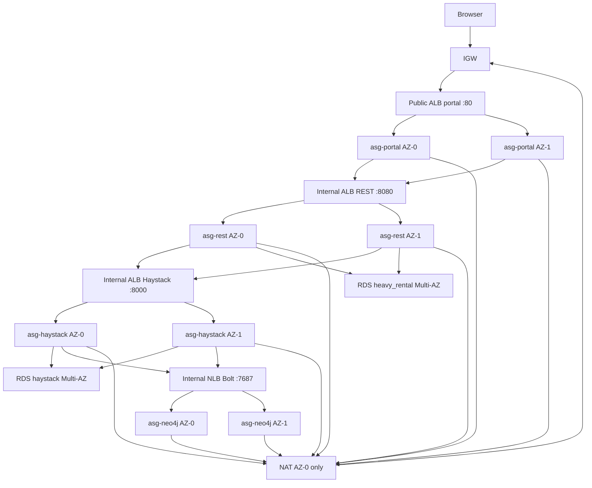

# Academy estate architecture

**Region:** `us-east-1` (first two available AZs, usually `us-east-1a` + `us-east-1b`).  
**IAM:** every EC2 uses **`LabInstanceProfile`** → **`LabRole`**. No IAM create.

This is the live target for `terraform/academy/`. `postgres-haystack-sync` is a **container**, not a third RDS.

## Layout (two AZs, not two full copies)

```
                    Internet
                        |
                   +---------+
                   |   IGW   |
                   +---------+
                        |
     +------------------+------------------+
     |   public AZ-0         public AZ-1   |
     |  10.0.0.0/24         10.0.1.0/24    |
     |  NAT t3.nano         (ALB only)     |
     |  portal ALB (spans both)            |
     +------------------+------------------+
                        |
     +------------------+------------------+
     |   app AZ-0            app AZ-1      |
     |  10.0.10.0/24        10.0.11.0/24   |
     |  asg-portal x1       asg-portal x1  |  desired=2
     |  asg-rest x1         asg-rest x1    |
     |  asg-haystack x1     asg-haystack x1|
     |  internal REST ALB + Haystack ALB   |
     |  0.0.0.0/0 -> shared NAT in AZ-0    |
     +------------------+------------------+
                        |
     +------------------+------------------+
     |   data AZ-0           data AZ-1     |
     |  10.0.20.0/24        10.0.21.0/24   |
     |  asg-neo4j x1        asg-neo4j x1   |  desired=2
     |  RDS SoR primary     RDS SoR standby|  Multi-AZ
     |  RDS Haystack pri.   RDS Haystack sb|
     |  internal Bolt NLB (spans both)     |
     +------------------+------------------+
```



## Counts

| Role | How many | Redundancy |
| --- | --- | --- |
| Portal / REST / Haystack EC2 | 2 each (one per app AZ) | AZ loss keeps one guest behind the ALB |
| Neo4j EC2 | 2 (one per data AZ) | AZ loss keeps one guest behind the Bolt NLB. **Not** a causal cluster |
| NAT | **1** in public AZ-0 | Shared by both private AZs (Vocareum **9 EC2** cap). Not a NAT Gateway |
| RDS `heavy_rental` | 1 Multi-AZ | Primary + standby |
| RDS `haystack` | 1 Multi-AZ | Primary + standby |
| `postgres-haystack-sync` | 0 RDS | Worker on `asg-haystack` (branch 3) |

**Guest count:** 8 ASG instances + 1 NAT = **9** EC2 (Vocareum default cap).

## Traffic

Browser → public portal ALB → portal → internal REST ALB → REST → SoR RDS.  
REST → internal Haystack ALB → Haystack → Haystack RDS + Bolt NLB → Neo4j.  
Private outbound HTTPS → the **single NAT** in public AZ-0 (cross-AZ). S3 via gateway endpoint (no NAT). If that NAT or AZ-0 dies, all private outbound fails.
