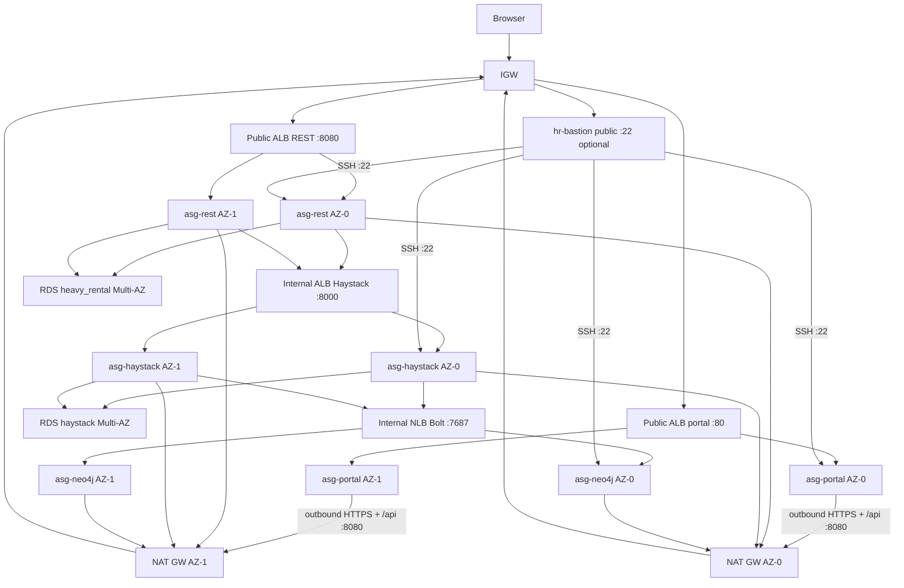
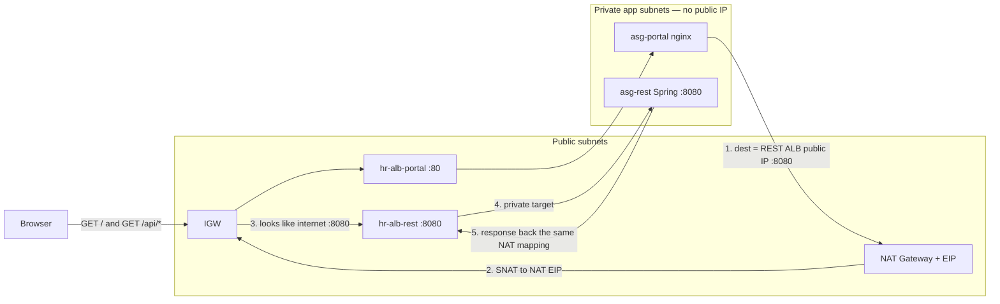
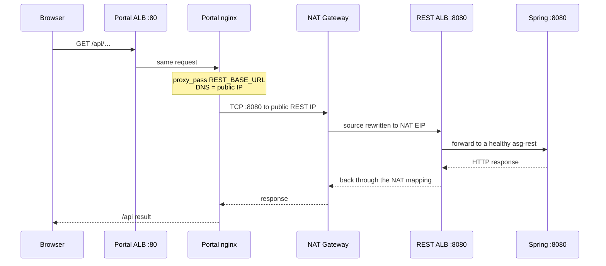

# Academy estate architecture

**Region:** `us-east-1` (first two available AZs, usually `us-east-1a` + `us-east-1b`).  
**IAM (academy):** every EC2 uses **`LabInstanceProfile`** → **`LabRole`**. No IAM create.  
**IAM (AWS_ACTUAL):** Terraform creates `hr-paid-{portal,rest,haystack,neo4j,bastion}` instance profiles. Auth is GitHub OIDC (`AWS_ROLE_TO_ASSUME`). Separate state bucket suffix `-actual` (S3 cannot use uppercase `AWS_ACTUAL`).

This is the live target for `terraform/academy/`. `postgres-haystack-sync` is a **container**, not a third RDS.

## Layout (two AZs, not two full copies)

```
                    Internet
                        |
                   +---------+
                   |   IGW   |
                   +---------+
                        |
     +------------------+------------------+
     |   public AZ-0         public AZ-1   |
     |  10.0.0.0/24         10.0.1.0/24    |
     |  NAT GW + EIP        NAT GW + EIP   |
     |  portal ALB + REST ALB (public)     |
     |  hr-bastion x1 (maintenance SSH)    |
     +------------------+------------------+
                        |
     +------------------+------------------+
     |   app AZ-0            app AZ-1      |
     |  10.0.10.0/24        10.0.11.0/24   |
     |  asg-portal x1       asg-portal x1  |  desired=2
     |  asg-rest x1         asg-rest x1    |
     |  asg-haystack x1     asg-haystack x1|
     |  internal Haystack ALB              |
     |  0.0.0.0/0 -> NAT GW in same AZ     |
     +------------------+------------------+
                        |
     +------------------+------------------+
     |   data AZ-0           data AZ-1     |
     |  10.0.20.0/24        10.0.21.0/24   |
     |  asg-neo4j x1        asg-neo4j x1   |  desired=2
     |  RDS SoR primary     RDS SoR standby|  Multi-AZ
     |  RDS Haystack pri.   RDS Haystack sb|
     |  internal Bolt NLB (spans both)     |
     +------------------+------------------+
```



## Counts

| Role | How many | Redundancy |
| --- | --- | --- |
| Portal / REST / Haystack EC2 | 2 each (one per app AZ) | AZ loss keeps one guest behind the ALB. REST ALB is public :8080; guests stay private |
| Neo4j EC2 | 2 (one per data AZ) | AZ loss keeps one guest behind the Bolt NLB. **Not** a causal cluster |
| Maintenance bastion | 1 (`hr-bastion`, public subnet) | Single EC2 jump host for SSH to the eight app guests (ADR 0021). Not an ASG, not behind an ALB |
| NAT | **2 Gateways** (one per public AZ) + EIP each | Same-AZ outbound for portal / REST / Haystack / Neo4j. Not an EC2 instance |
| RDS `heavy_rental` | 1 Multi-AZ | Primary + standby |
| RDS `haystack` | 1 Multi-AZ | Primary + standby |
| `postgres-haystack-sync` | 0 RDS | Worker on `asg-haystack`: `postgres:17` + `sync-from-primary.sh` (60s). Not a third RDS |
| `neo4j-populate` | 0 RDS | Same guest: `python:3.12-slim` + `populate_neo4j.py` (60s + compose `:8089`) |

**Guest count:** 8 app ASG instances + **1** bastion + **0** NAT EC2 = **9** EC2 (Vocareum default cap is 9). Do not add another instance while this estate is running.

## Traffic

Browser → public portal ALB → portal → **NAT Gateway** → public REST ALB `:8080` → REST → SoR RDS.  
Internet clients may also hit the REST ALB `:8080` directly (`REST_BASE_URL`). `sync-secrets` sets `APP_CORS_ALLOWED_ORIGINS` to the portal origin and `http://<rest_alb_dns>:8080` ([`../specification/pipelines/infra-secrets.md`](../specification/pipelines/infra-secrets.md)).  
REST → internal Haystack ALB → Haystack → Haystack RDS + Bolt NLB → Neo4j.  
On `asg-haystack`, `postgres-haystack-sync` merges SoR RDS → Haystack RDS (`postgres_fdw`, `sg-rds` self :5432). `neo4j-populate` reads Haystack RDS and writes Bolt (`NEO4J_URI`). HTTP `:8089` is Compose DNS only ([ADR 0020](adr/0020-haystack-devcontainer-workers.md)).  
Private outbound HTTPS → the **NAT Gateway in the same AZ**. S3 via gateway endpoint (no NAT). If AZ-0 dies, AZ-1 guests keep outbound. NAT Gateways bill until `action=destroy`; session end and `action=stop` do not pause them.

**Break-glass SSH:** operators SSM (or optional CIDR SSH from `BASTION_SSH_CIDRS`) onto `hr-bastion`. Interactive SSM becomes **ec2-user** — do not write SSH config. Then `ssh portal` / `ssh rest-2` / `ssh haystack` / `ssh neo4j` (Host aliases from `hr-ssh-config`, `IdentityFile` = role **private** key from SM `private_key_pem` plus hop key). If the shell is still `ssm-user`, `hr-ssh portal`. `hr-ssh-pull-keys` refreshes those private keys from Secrets Manager. App guests never get a private key. App SGs allow `:22` only from `sg-bastion`, never from `0.0.0.0/0`. Helper: [`../scripts/bastion-connect.sh`](../scripts/bastion-connect.sh).

### Portal `/api` hairpin through NAT

The SPA calls same-origin `/api`. Guest nginx `proxy_pass`es to `REST_BASE_URL=http://<rest_alb_dns>:8080`. That DNS is the **internet-facing** REST ALB, so it resolves to **public** IPs. Portal guests have no public IP; the packet must leave through the same-AZ NAT Gateway and come back in as internet traffic on `:8080`.





| Hop | What it is | Direction |
| --- | --- | --- |
| Browser → portal ALB | Public `:80` | Inbound to the SPA |
| Portal → NAT | Private guest, no public IP | **Outbound** |
| NAT → REST ALB | NAT EIP talks to the public `:8080` listener | Outbound, then inbound on the ALB |
| REST ALB → Spring | Private target in `tg-rest` | East-west inside the VPC |

`sg-portal` must egress TCP 8080 to **both** `sg-alb-rest` (private ENI) **and** `0.0.0.0/0` (`portal_to_rest_public`). The public REST DNS never matches the SG-to-SG rule. Without the CIDR rule, nginx waits for the default 60s `proxy_connect_timeout` and returns **504**. A laptop `GET http://<rest_alb>:8080/actuator/health` can still be 200.

REST → Haystack does **not** use this path. `hr-alb-haystack` is internal; `HAYSTACK_BASE_URL` resolves to private IPs and SG-to-SG on `:8000` is enough.

### NAT Gateways are outbound only

The two NAT Gateways (`connectivity_type = public`, one EIP each) only forward connections **started by** private guests (SSM, ECR, yum, Secrets Manager, and the portal `/api` hairpin). The internet cannot open a new connection **to** a portal or REST instance through NAT. Return packets are allowed only for the NAT mapping the guest created. `action=stop` does not pause Gateways.

## ALB / NLB health checks

Terraform target groups probe each **registered instance private IP**. Matcher **`200-299`** means **2xx only** (3xx/4xx/5xx stay unhealthy). ASGs still use `health_check_type = EC2` (ADR 0008): an unhealthy target does **not** replace the instance.

| Target group | Probe | Matcher | Notes |
| --- | --- | --- | --- |
| `tg-portal` | `http://<instance-ip>:80/` | `200-399` | 502 until nginx is composed |
| `tg-rest` | `http://<instance-ip>:8080/actuator/health` | **`200-299`** | Spring Security **401**s `GET /` — not this check |
| `tg-haystack` | `http://<instance-ip>:8000/health` | **`200-299`** | `GET /` is 404; `/docs` is OpenAPI, not the ALB check |
| `tg-neo4j` | TCP `<instance-ip>:7687` | TCP | Internal Bolt NLB |

`deploy-projects` / `site.yml` waits for REST `:8080/actuator/health` and Haystack `:8000/health` to return 2xx before the play succeeds.

## Terraform vs Ansible

**Terraform** (`terraform/academy/`) creates the architecture: VPC, two NAT Gateways, four app ASGs + **`hr-bastion`** (single EC2), ALBs (portal :80 and REST :8080 internet-facing; Haystack internal), two Multi-AZ RDS, Bolt NLB, empty SM shells, and Monitor (CloudTrail + CloudWatch + S3 logs). Academy guests use **`LabInstanceProfile` → `LabRole`** (no IAM create). AWS_ACTUAL guests use Terraform `hr-paid-*` profiles (including `hr-paid-bastion`).  
**Ansible** only configures guests that already exist: Docker, SM → `.env`, compose, portal `/api`. It does not create or destroy VPC/ASG/RDS and does **not** compose onto `hr-bastion`.

## Monitor (apply)

| Signal | Where |
| --- | --- |
| API audit | CloudTrail `heavy-rental-academy` → observe S3 (`cloudtrail/`). **No** trail → CloudWatch Logs (Vocareum). |
| VPC accept/reject | Flow logs → same bucket (`vpc-flow/`). S3 destination — **not** LabRole (wrong trust). |
| ALB requests | Access logs on portal / REST / Haystack ALBs → `alb/` |
| Health | Dashboard `heavy-rental-academy`; alarms on ALB 5xx / unhealthy, RDS CPU / storage, four app ASG InService, `hr-bastion` `StatusCheckFailed` |
| Guest logs | Docker Engine `awslogs` → `/heavy-rental/{portal,rest,haystack,neo4j}` (instance profile). Ansible probes `logs:CreateLogStream`; `daemon.json` uses Engine log-opts (`awslogs-region`, `awslogs-group`, `tag`) — not ECS `awslogs-stream-prefix`. No CloudWatch Agent. If the probe is denied or dockerd rejects the file, guests stay on `json-file` and `docker logs` over SSM. |

Optional Environment variable `ALARM_EMAIL` subscribes SNS topic `hr-academy-alarms` (confirm the AWS mail). Cost Explorer stays the Vocareum budget UI — not Terraform.

## Configure (Ansible)

`action=apply` runs Terraform first, then `sync-secrets` → `sync-ssh-keys` → Ansible **`configure.yml`** (Docker + Compose on app guests; compose **Neo4j only**; hop keys on `hr-bastion`). `guest_base` probes `logs:CreateLogStream` and may set Docker Engine `awslogs` (not ECS `awslogs-stream-prefix`); otherwise guests stay on `json-file`. `action=configure-only` does **not** run Terraform apply; Ansible is the **same** playbook. Neither action pulls portal / REST / Haystack images. Neither composes onto `hr-bastion`.

`action=deploy-projects` is a **later** workflow run after apply or configure-only (ADR 0014). It is not a job at the end of apply. Preflight requires public GHCR or ECR tags, then Ansible **`site.yml`**. Day-to-day single-image rolls stay app CD.

`group_vars` does **not** hardcode GHCR paths. It looks up GitHub Environment variables `PORTAL_IMAGE` / `REST_IMAGE` / `HAYSTACK_IMAGE` on the Ansible controller (infra repo Environment `academy`).

| Role | Image | Notes |
| --- | --- | --- |
| Portal | Env `PORTAL_IMAGE` or stock `nginx` | `/api` → `REST_BASE_URL` (public REST ALB DNS; NAT hairpin). ECR tags get `docker login` on the guest. Public GHCR pulls with no login. |
| REST / Haystack | Env `REST_IMAGE` / `HAYSTACK_IMAGE` or Run `image_ref` | Fail if empty. Haystack compose has **no** `neo4j` service. Compose waits for REST `:8080/actuator/health` **2xx** and Haystack `:8000/health` **2xx**. |
| Neo4j | `neo4j:5` | `/data` on extra EBS |

Portal SM JSON includes `STRIPE_PUBLISHABLE_KEY` and `VITE_STRIPE_PUBLISHABLE_KEY` (same `pk_`). REST has `STRIPE_API_KEY` + webhook. Prefer a **new tag** on each redeploy (`compose up` does not `--pull always`). Haystack SM includes `SOURCE_*` (SoR) and `TARGET_*` (Haystack RDS) from infra `sync-secrets` (ADR 0013).

Portal-only redeploy: portal app CD in `heavy-rental-web-portal-pipeline/deploy-pipeline/` (same `guest_base` + `portal`, `--limit portal`, **no Terraform**). REST-only: `heavy-rental-rest-api/deploy-pipeline/`. Haystack-only: `haystack-fast-api-pipeline/deploy-pipeline/`.
