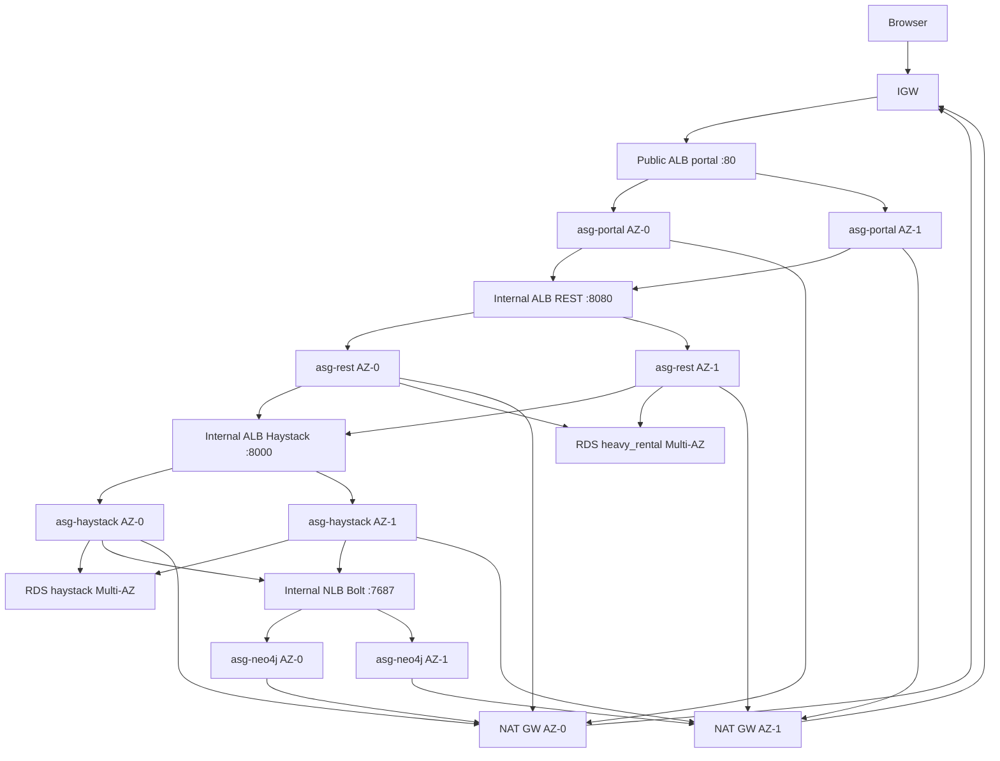

# Academy estate architecture

**Region:** `us-east-1` (first two available AZs, usually `us-east-1a` + `us-east-1b`).  
**IAM:** every EC2 uses **`LabInstanceProfile`** → **`LabRole`**. No IAM create.

This is the live target for `terraform/academy/`. `postgres-haystack-sync` is a **container**, not a third RDS.

## Layout (two AZs, not two full copies)

```
                    Internet
                        |
                   +---------+
                   |   IGW   |
                   +---------+
                        |
     +------------------+------------------+
     |   public AZ-0         public AZ-1   |
     |  10.0.0.0/24         10.0.1.0/24    |
     |  NAT GW + EIP        NAT GW + EIP   |
     |  portal ALB (spans both)            |
     +------------------+------------------+
                        |
     +------------------+------------------+
     |   app AZ-0            app AZ-1      |
     |  10.0.10.0/24        10.0.11.0/24   |
     |  asg-portal x1       asg-portal x1  |  desired=2
     |  asg-rest x1         asg-rest x1    |
     |  asg-haystack x1     asg-haystack x1|
     |  internal REST ALB + Haystack ALB   |
     |  0.0.0.0/0 -> NAT GW in same AZ     |
     +------------------+------------------+
                        |
     +------------------+------------------+
     |   data AZ-0           data AZ-1     |
     |  10.0.20.0/24        10.0.21.0/24   |
     |  asg-neo4j x1        asg-neo4j x1   |  desired=2
     |  RDS SoR primary     RDS SoR standby|  Multi-AZ
     |  RDS Haystack pri.   RDS Haystack sb|
     |  internal Bolt NLB (spans both)     |
     +------------------+------------------+
```



## Counts

| Role | How many | Redundancy |
| --- | --- | --- |
| Portal / REST / Haystack EC2 | 2 each (one per app AZ) | AZ loss keeps one guest behind the ALB |
| Neo4j EC2 | 2 (one per data AZ) | AZ loss keeps one guest behind the Bolt NLB. **Not** a causal cluster |
| NAT | **2 Gateways** (one per public AZ) + EIP each | Same-AZ outbound for portal / REST / Haystack / Neo4j. Not an EC2 instance |
| RDS `heavy_rental` | 1 Multi-AZ | Primary + standby |
| RDS `haystack` | 1 Multi-AZ | Primary + standby |
| `postgres-haystack-sync` | 0 RDS | Worker on `asg-haystack` (compose profile/command) |

**Guest count:** 8 ASG instances + **0** NAT EC2 = **8** EC2 (Vocareum default cap is 9).

## Traffic

Browser → public portal ALB → portal → internal REST ALB → REST → SoR RDS.  
REST → internal Haystack ALB → Haystack → Haystack RDS + Bolt NLB → Neo4j.  
Private outbound HTTPS → the **NAT Gateway in the same AZ**. S3 via gateway endpoint (no NAT). If AZ-0 dies, AZ-1 guests keep outbound. NAT Gateways bill until `action=destroy`; session end and `action=stop` do not pause them.

## Terraform vs Ansible

**Terraform** (`terraform/academy/`) creates the architecture: VPC, two NAT Gateways, four ASGs, ALBs, two Multi-AZ RDS, Bolt NLB, empty SM shells.  
**Ansible** only configures guests that already exist: Docker, SM → `.env`, compose, portal `/api`. It does not create or destroy VPC/ASG/RDS.

## Configure (Ansible)

`action=apply` runs Terraform first, then `sync-secrets` → `sync-ssh-keys` → Ansible **`configure.yml`** (Docker + Compose on all guests; compose **Neo4j only**). `action=configure-only` does **not** run Terraform apply; Ansible is the **same** playbook. Neither action pulls portal / REST / Haystack images.

`action=deploy-projects` is a **later** workflow run after apply or configure-only (ADR 0014). It is not a job at the end of apply. Preflight requires public GHCR or ECR tags, then Ansible **`site.yml`**. Day-to-day single-image rolls stay app CD.

`group_vars` does **not** hardcode GHCR paths. It looks up GitHub Environment variables `PORTAL_IMAGE` / `REST_IMAGE` / `HAYSTACK_IMAGE` on the Ansible controller (infra repo Environment `academy`).

| Role | Image | Notes |
| --- | --- | --- |
| Portal | Env `PORTAL_IMAGE` or stock `nginx` | `/api` → `REST_BASE_URL`. ECR tags get `docker login` on the guest. Public GHCR pulls with no login. |
| REST / Haystack | Env `REST_IMAGE` / `HAYSTACK_IMAGE` or Run `image_ref` | Fail if empty. Haystack compose has **no** `neo4j` service. |
| Neo4j | `neo4j:5` | `/data` on extra EBS |

Portal SM JSON includes `STRIPE_PUBLISHABLE_KEY` and `VITE_STRIPE_PUBLISHABLE_KEY` (same `pk_`). REST has `STRIPE_API_KEY` + webhook. Prefer a **new tag** on each redeploy (`compose up` does not `--pull always`). Haystack SM includes `SOURCE_*` (SoR) and `TARGET_*` (Haystack RDS) from infra `sync-secrets` (ADR 0013).

Portal-only redeploy: portal app CD in `heavy-rental-web-portal-pipeline/deploy-pipeline/` (same `guest_base` + `portal`, `--limit portal`, **no Terraform**). REST-only: `heavy-rental-rest-api/deploy-pipeline/`. Haystack-only: `haystack-fast-api-pipeline/deploy-pipeline/`.
