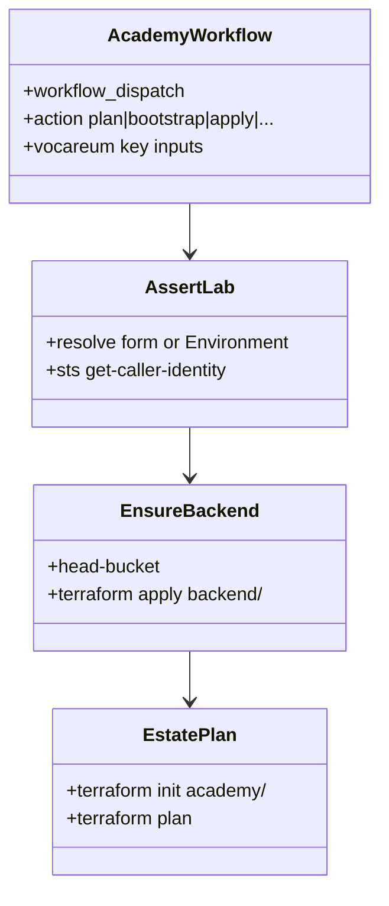

# REASONS Canvas: add-infra-academy-bootstrap

**Input analysis:** [add-infra-academy-bootstrap.md](../analysis/add-infra-academy-bootstrap.md)  
**Behavior contract:** [OpenSpec change](../../openspec/changes/add-infra-academy-bootstrap/)

When reality diverges, fix this prompt first — then update YAML / `.tf`.

---

## R — Requirements

- Academy / Vocareum only. Environment must be `academy`.
- Operator pastes three AWS Details values on Run workflow (they change every Start Lab) or uses Environment fallback.
- Mask credentials. Never write them to Secrets Manager or the guest.
- First `plan`/`bootstrap` creates the S3 state bucket if missing. Estate `init` uses `use_lockfile=true`. Do **not** create a DynamoDB lock table.
- Estate `terraform plan` uses that backend and contains no VPC.
- `apply` / configure / stop / destroy fail on this branch.

## E — Entities

| Name | Path |
| --- | --- |
| Workflow | `.github/workflows/aws-infra-academy.yml` |
| Backend TF | `terraform/backend/` |
| Estate TF | `terraform/academy/` |
| State bucket | `heavy-rental-tfstate-<account>-academy` |
| Estate key | `estate/terraform.tfstate` |
| Lock | S3 native `use_lockfile=true` (no DynamoDB). Leftover `heavy-rental-tfstate-lock-academy`, if present, is unused. |

## A — Approach

- Copy credential resolve + mask from the feasibility example; make `assert-lab` real.
- Refuse `aws_environment != academy` before any AWS mutate.
- `ensure-backend`: `head-bucket`; if 404, `terraform apply` in `terraform/backend` (local state), then `aws s3 cp` state to `backend/terraform.tfstate`.
- Estate: `init -backend-config=bucket=...` then `plan`. Refuse `apply`.
- Bind `inputs.*` / `secrets.*` through `env:` in every `run:` script.

## S — Structure

See OpenSpec proposal. Specs live next to this repo’s workflows (not in the CI pipeline-development tree).

## O — Operations

| `action` | Jobs |
| --- | --- |
| `plan` | assert-lab → ensure-backend → terraform plan |
| `bootstrap` | assert-lab → ensure-backend |
| `apply` / configure / stop / destroy | fail closed |

## N — Norms

- `set +x` around credentials. `::add-mask::` all three values.
- Region `us-east-1`.
- No `aws_iam_role`. Tags include `Lab=aws-academy-vocareum`.

## S — Safeguards (negative space)

- Do **not** add OIDC / `id-token: write` / `AWS_ROLE_TO_ASSUME`.
- Do **not** add `aws_vpc`, ALB, RDS, or ASG on this branch.
- Do **not** put Vocareum keys in Secrets Manager.
- Do **not** add a paid workflow or Ansible playbooks.
- Do **not** interpolate `${{ github.* }}` or `${{ inputs.* }}` inside `run:` (use `env:`).
