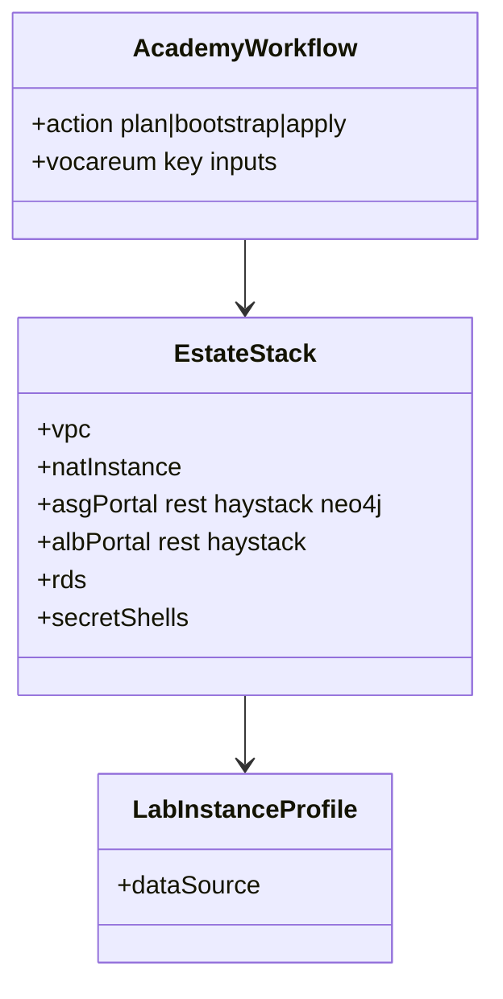

# REASONS Canvas: add-infra-academy-estate

**Input analysis:** [add-infra-academy-estate.md](../analysis/add-infra-academy-estate.md)  
**Behavior contract:** [OpenSpec change](../../openspec/changes/add-infra-academy-estate/)

When reality diverges, fix this prompt first — then update YAML / `.tf`.

---

## R — Requirements

- Academy / Vocareum only. Environment must be `academy`. Form keys unchanged.
- `action=plan` plans the estate. `action=apply` creates it.
- Three-tier VPC, NAT **instance**, §6.2 security groups, four ASGs, three ALBs, one RDS, SM shells, ECR.
- `LabInstanceProfile` only. No IAM role, NAT Gateway, Marketplace AMI, Multi-AZ, PEM in Terraform.
- RDS password from Environment `SPRING_DATASOURCE_PASSWORD`. Fail apply if missing.
- `configure-only` / `stop` / `destroy` fail on this branch.

## E — Entities



## A — Approach

1. Data-source AMI (AL2023 SSM parameter) and `LabInstanceProfile`.
2. VPC + routes; NAT instance with IP forwarding; S3 gateway endpoint.
3. Security groups as separate ingress/egress rules (avoid cycles).
4. Launch templates + ASGs; Neo4j dedicated ENI; EC2 health.
5. ALBs + target groups (register, but ASG health stays EC2).
6. RDS `db.t3.micro` + empty SM secrets + ECR.
7. Workflow: remove branch-1 apply refuse; pass `TF_VAR_db_master_password`.

## S — Structure

```
terraform/academy/{variables,data,vpc,nat,security_groups,alb,compute,rds,secrets,ecr,outputs}.tf
.github/workflows/aws-infra-academy.yml
openspec/changes/add-infra-academy-estate/
spdd/{analysis,prompt}/add-infra-academy-estate.md
docs/adr/0004–0008
```

## O — Operations

| action | This branch |
| --- | --- |
| plan | init + plan estate |
| bootstrap | backend only |
| apply | init + plan + apply |
| configure-only / stop / destroy | fail closed |

## N — Norms

- Mask Vocareum keys and the DB password. `set +x` on credential steps.
- Do not print `SecretString` or `sk_`.
- Public portal ALB DNS may appear in the step summary.
- Bind `github.*` / `inputs.*` through `env:` in `run:` scripts.

## S — Safeguards

- No `aws_iam_role`, `aws_nat_gateway`, `tls_private_key`, `key_name`, `aws_secretsmanager_secret_version`.
- No Vocareum keys in SM or on the guest.
- No paid workflow / OIDC.
- Apply refuses empty or plan-only DB password.
- ASG health = EC2 until branch 3 compose.

## Negative space

Do not invent: IAM roles, NAT Gateway, Marketplace Neo4j CFT, Multi-AZ RDS, HTTPS listener, Ansible, `put-secret-value` of app fields, ELB health replacement, `destroy`.
