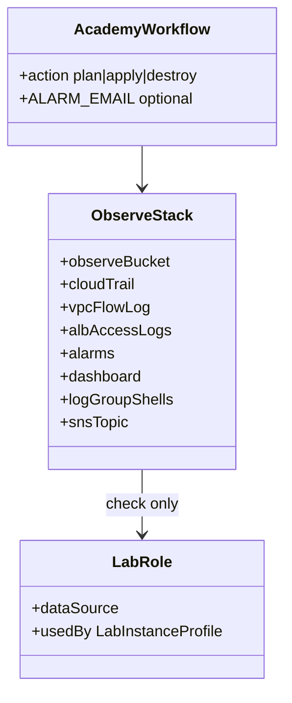

# REASONS Canvas: add-infra-academy-observe

**Input analysis:** [add-infra-academy-observe.md](../analysis/add-infra-academy-observe.md)  
**Behavior contract:** [OpenSpec change](../../openspec/changes/add-infra-academy-observe/)

When reality diverges, fix this prompt first — then update YAML / `.tf`.

---

## R — Requirements

- Academy / Vocareum only. Environment must be `academy`.
- `action=apply` creates Monitor resources in the same estate state. No new `action`.
- CloudTrail + VPC flow logs + ALB access logs → S3 observe bucket. No IAM role for delivery.
- CloudWatch alarms + dashboard. RDS enhanced monitoring stays off.
- Only IAM identity: data-source **`LabRole`** via **`LabInstanceProfile`**.
- Optional `ALARM_EMAIL`. Empty is valid.
- Reconcile imports leftovers; destroy sweeps them.

## E — Entities



## A — Approach

1. Keep `data.aws_iam_role.lab` and `data.aws_iam_instance_profile.lab`. Fail unless profile role is LabRole.
2. Observe bucket + lifecycle 14d + bucket policy for CloudTrail, ELB, `delivery.logs.amazonaws.com`.
3. `aws_cloudtrail` with `s3_bucket_name` only (no `cloud_watch_logs_*`).
4. `aws_flow_log` `log_destination_type = s3`. No `iam_role_arn`.
5. ALB `access_logs` on portal / REST / Haystack. ASG `enabled_metrics`.
6. Metric alarms + dashboard. SNS topic; email subscription if `alarm_email` set.
7. Four log groups. No CloudWatch Agent. Ansible `guest_base` probes `logs:CreateLogStream` and, when allowed, writes Docker Engine `awslogs` into `/etc/docker/daemon.json` (`awslogs-region`, `awslogs-group`, `tag` — not ECS `awslogs-stream-prefix`). Denied probe or dockerd reject → `json-file`, play continues.
8. Workflow `TF_VAR_alarm_email`. Reconcile + sweep named objects.

## S — Structure

```
terraform/academy/observe.tf
terraform/academy/{variables,outputs,alb,compute}.tf
.github/workflows/aws-infra-academy.yml
scripts/{reconcile-estate,sweep-estate-orphans}.sh
openspec/changes/add-infra-academy-observe/
spdd/{analysis,prompt}/add-infra-academy-observe.md
docs/adr/0015-academy-observe-no-iam.md
```

## O — Operations

| action | Observe |
| --- | --- |
| plan / apply | Import leftovers, then create/update trail, bucket, alarms, dashboard |
| destroy | Destroy + sweep trail, observe bucket, alarms, flow logs |
| configure-only / deploy-projects / app CD | No Terraform observe job. Ansible `guest_base` probes CloudWatch Logs and may set Engine `awslogs` |
| stop | Unchanged (no Terraform observe job) |

## N — Norms

- Do not print `sk_` or SecretString. Email in `ALARM_EMAIL` is not a secret; do not treat it as Vocareum keys.
- Alarm descriptions use names (`hr-alb-rest`), not internal DNS.
- Public portal ALB DNS and dashboard name may appear in the step summary.

## S — Safeguards

- No `aws_iam_role`, `aws_iam_instance_profile` **resource**, OIDC provider.
- No `cloud_watch_logs_group_arn` / `cloud_watch_logs_role_arn` on CloudTrail.
- No `iam_role_arn` on `aws_flow_log`.
- No RDS `monitoring_interval` other than `0`.
- No X-Ray, AMP, OpenSearch, GuardDuty, Config, Budgets resources.
- Do not attach LabRole to CloudTrail or flow-log delivery (trust is EC2).
- Launch templates stay on `LabInstanceProfile`.
- Do not put ECS-only `awslogs-stream-prefix` in `/etc/docker/daemon.json`. Docker Engine log-opts only (`awslogs-region`, `awslogs-group`, `tag`). If dockerd rejects the file, revert to `json-file` and do not fail the play.
