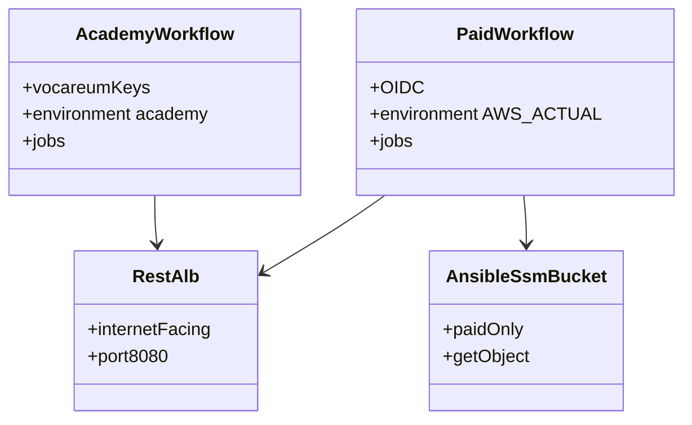

# REASONS Canvas: add-infra-paid-pipeline

**Input analysis:** [add-infra-paid-pipeline.md](../analysis/add-infra-paid-pipeline.md)  
**Behavior contract:** [OpenSpec change](../../openspec/changes/add-infra-paid-pipeline/)

When reality diverges, fix this prompt first — then update YAML / `.tf`.

---

## R — Requirements

- Two Actions, **separate job graphs** (no `aws-infra-estate.yml`): academy Vocareum-only, paid OIDC-only.
- Same Terraform root and Ansible playbooks. Same actions on both files.
- Environment `AWS_ACTUAL` / state suffix `-actual`. Do not rename to `paid`.
- Paid SSM bucket `heavy-rental-ssm-<account>-actual`; guests GetObject only. Academy keeps the tfstate bucket for SSM transfer.
- REST ALB internet-facing :8080 in public subnets; REST instances private + NAT. Haystack / Bolt / RDS stay internal. Portal ALB stays public :80 only.
- Academy still creates no `aws_iam_role`. Paid guests use `hr-paid-*`.
- Observe trail/dashboard/flow-log leftover names follow `DEPLOYMENT` (`heavy-rental-academy` or `heavy-rental-actual`).
- No HTTPS, no CloudTrail → Logs. This Action does not author portal/REST/Haystack **app** CD (those paid callers live in `heavy-rental-project-pipeline-development`).

## E — Entities



## A — Approach

1. Each operator YAML contains the full job graph. Delete `aws-infra-estate.yml`.
2. Fail-closed Environment asserts. Academy has no `id-token: write`. Paid declares no Vocareum inputs.
3. Terraform: REST ALB public + SG :8080 from internet; paid SSM bucket + guest GetObject; observe name from `var.deployment`.
4. `sync-secrets` CORS = portal origin + `http://<rest_alb_dns>:8080`.
5. Reconcile/sweep require `DEPLOYMENT` and use that profile’s observe names.
6. Docs: OIDC sample trust; REST public URL in apply summary.

## S — Structure

```
.github/workflows/aws-infra-academy.yml
.github/workflows/aws-infra-paid.yml
terraform/academy/{alb,security_groups,ssm,iam,observe,data,outputs,main}.tf
scripts/{reconcile-estate,sweep-estate-orphans,sync-secrets}.sh
docs/adr/0017-two-actions-academy-paid.md
docs/adr/0018-public-rest-alb.md
docs/adr/0019-separate-job-graphs.md
docs/samples/github-oidc-paid.json
openspec/changes/add-infra-paid-pipeline/
spdd/{analysis,prompt}/add-infra-paid-pipeline.md
specification/pipelines/infra-paid.md
```

## O — Operations

| action | Both Actions (own YAML) |
| --- | --- |
| plan | import leftovers → show estate (no apply) |
| bootstrap | state backend only |
| apply | estate → `sync-secrets` → PEMs → `configure.yml` (Neo4j only) |
| configure-only | no Terraform apply; same Ansible as apply |
| deploy-projects | later `site.yml` (first compose). Image vars from **this** Environment |
| stop | ASG desired=0 + stop both RDS |
| destroy | terraform destroy + **this** `DEPLOYMENT` leftover sweep; keeps state bucket |

Paid first-compose is `deploy-projects` on the paid Action. Day-to-day portal / REST / Haystack rolls are the app-CD paid callers in `heavy-rental-project-pipeline-development` (not this YAML). OIDC provider + role are created out of band before the first paid `plan`.

## N — Norms

- Mask Vocareum keys and `sk_`. `set +x` on credential steps.
- Do not print `SecretString` or PEMs.
- Apply summary may print public portal DNS and public REST DNS (`http://<dns>:8080`).
- Bind `github.*` / `inputs.*` through `env:` in `run:` scripts.
- Paid YAML has nowhere to paste lab keys; do not add those inputs “for convenience”.

## S — Safeguards

- Paid YAML has no `aws_access_key_*` inputs.
- Academy dispatcher exits 1 unless Environment is `academy`. Paid dispatcher exits 1 unless Environment is `AWS_ACTUAL`, `AWS_ACCESS_KEY_ID` is empty, and `AWS_ROLE_TO_ASSUME` is set.
- Academy plan jq still refuses `aws_iam_role` create. Paid YAML does not run that check.
- Haystack ALB remains internal. No public 8000/5432/7687.
- Guest IAM has no `s3:PutObject` on the state bucket. Paid SSM bucket is GetObject/ListBucket.
- Reconcile/sweep fail if `DEPLOYMENT` is unset. Paid observe lookups never use `heavy-rental-academy` trail/dashboard/flow. Academy never uses `-actual`.
- Distinct concurrency groups (`aws-infra-academy-…` / `aws-infra-paid-…`).

## Negative space

Do not invent: ACM / HTTPS listeners, CloudTrail → CloudWatch Logs, Marketplace Neo4j CFT, a second Terraform root, Environment rename to `paid`, a shared `aws-infra-estate.yml`, renaming RDS/VPC identifiers, ELB health-check path change. Do not author portal/REST/Haystack app CD in this repo.
