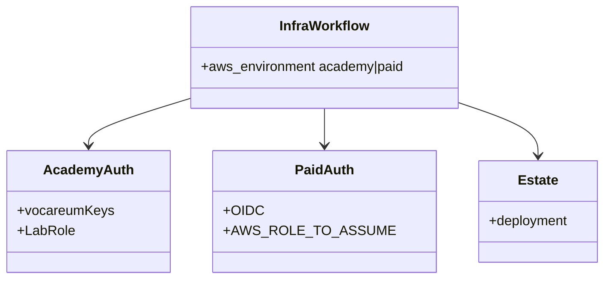

# REASONS Canvas: add-infra-paid-profile

**Status:** Superseded in part by [add-infra-paid-pipeline](add-infra-paid-pipeline.md) — two Actions; isolation remains.  
**Input analysis:** [add-infra-paid-profile.md](../analysis/add-infra-paid-profile.md)  
**Behavior contract:** [OpenSpec](../../openspec/changes/add-infra-paid-profile/)

## R — Requirements

**This change (historical):** one workflow; `aws_environment` is `academy` or paid.

**Current (after `add-infra-paid-pipeline`):** two Actions. Academy file is Vocareum-only (`academy`). Paid file is OIDC-only (Environment **`AWS_ACTUAL`**, suffix **`-actual`**). Isolation below still holds.

- Academy: Vocareum keys; LabRole; no IAM create.
- Paid: OIDC; created `hr-paid-*` profiles; no Vocareum keys.
- Separate state buckets. Same `action` list.

## E — Entities



## A — Approach

1. Guard Environment name.
2. Branch credentials (keys vs OIDC).
3. `TF_VAR_deployment` selects LabRole data vs `iam.tf`.
4. Bucket suffix from profile.
5. Academy-only LabRole preflight.

## S — Structure

```
.github/workflows/aws-infra-academy.yml
.github/actions/resolve-aws-profile/
terraform/academy/{variables,data,iam,compute,observe}.tf
scripts/{reconcile-estate,sweep-estate-orphans}.sh
docs/adr/0016-dual-profile-academy-paid.md
```

## O — Operations

Same `action` list. Operator picks Environment. **Later** `add-infra-paid-pipeline` (ADR 0017) splits this into two Actions; paid Environment is `AWS_ACTUAL` (not feasibility’s `paid`).

## N — Norms

Do not print keys or `sk_`. Paid summary may print the assumed role ARN.

## S — Safeguards

- No Vocareum keys on paid. No `AWS_ACCESS_KEY_ID` secret on the paid Environment (`AWS_ACTUAL` after ADR 0017).
- No `aws_iam_role` create when `deployment=academy`.
- No `LabRole` / `LabInstanceProfile` data source when `deployment=paid`.
- No shared state object.
- No Marketplace Neo4j CFT.
